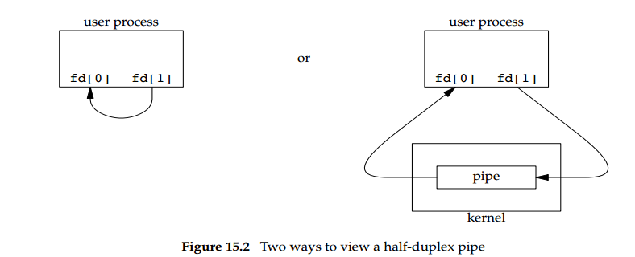
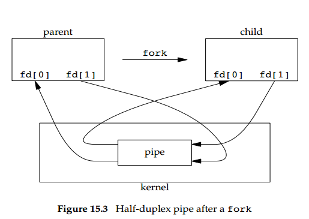
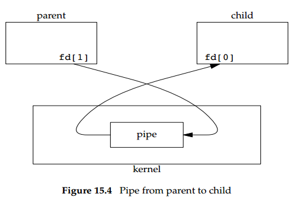

# Chapter 15 Interprocess Communication

## 15.2 Pipes

Pipes是最古老的UNIX System IPC方式。
所有的UNIX系统都支持它。
Pipes有两个限制：
1.历史上的Pipes仅仅实现了半双工工作方式（即数据只向一个方向流动）。
  一些系统现在支持全双工pipes,但为了最大可能的可移植性，我们绝对不能假设情况就是这样的。
2.Pipes仅可用在有共同祖先的进程之间，一般的，一个pipe是被进程创建的：进程调用fork函数,
  pipe用在父进程和子进程之间。

FIFOS绕过了第二个限制，UNIX domain sockets绕过了上面的两个限制。

尽管有这些限制，半双工pipes仍然是最常用的IPC形式。每次你在shell的管道中执行一串commands，
shell就为每一个command创建了一个单独的进程并把一个进程的标准输出(standard output)连接到另一个使用pipe的标准输入(standard input).

创建管道的函数如下:
***

```
#include < unistd.h>

int pipe(int fd[2]);

	Returns:0 if OK,-1 on error
```
***
这个函数通过fd参数返回两个打开的file descriptor：fd[0]读fd[1]写。fd[1]的输出是fd[0]
的输入。
图15.2 左侧展示的是在一个独立进程中的一个首尾相连的pipe；
右侧指明了pipe中的数据流动需要经过kernel.



**fstat**函数的**S_ISFIFO**宏可以检出pipe的fd[0]和fd[1]这两个文件描述符为FIFO文件类型，

单进程中的pipe近乎无用。一般说来，进程调用pipe之后会继续调用fork来创建从parent到child的IPC channel，反之亦然。图15.3展示了这个场景：



fork之后发生什么取决于我们希望数据怎么流动。如果我们希望数据从parent流向child,那么parent就得关闭pipe的读端fd[0]和child的写端fd[1].图15.4展示了这个操作结果:



如果希望pipe中的数据从child流向parent，那么就需要parent关闭fd[1],child关闭fd[0].

关闭pipe的某一端之后，两条原则生效：

1.如果我们read一个写端已关闭的pipe,read returns 0表明所有的数据已经读取完毕，文件结束。（从技术角度，我们应该说这一端的
    文件不再生成，因为已经没有writers往pipe中写了。可能会出现duplicate一个pipe descriptor的操作以便多进程写打开的pipe
    。尽管如此，一般的pipe只会有单一的reader和单一的writer.当我们下一节讲述FIFOs的时候，将会看到一个FIFO经常会有多
    writers。）

2.如果我们写一个read端已经关闭的pipe,会发出SIGPIPE信号。无论是我们ignore信号还是catch它还是从signal handler返回，write端return -1并把errno设置为EPIPE.

当我们写pipe(或者FIFO)时，常量**PIPE_BUF**指定了内核的pipe buffer大小。
从其它几个进程往同一个pipe(或FIFO)中、一次小于等于PIPE_BUF字节的写入不会导致数据错乱,
如果大于**PIPE_BUF**字节，可能会与其它几个writers写的数据混淆。我们可以使用**pathconf**
或者**fpathconf**来定制**PIPE_BUF**的值。

**Example**
***
```
#include "apue.h"

int main(void)
{
    int n;
    int fd[2];
    pid_t pid;
    char line[MAXLINE];

    if(pipe(fd)<0)
        err_sys("pipe error");
    if((pid = fork())< 0){
        err_sys("fork error");
    }else if(pid > 0){/*parent*/
        close(fd[0]);
        write(fd[1],"hello world\n",12);
    }else{/*child*/
        close(fd[1]);
        n = read(fd[0],line,MAXLINE);
        write(STDOUT_FILENO,line,n);
    }
    exit(0);
}
```
***
请注意这里pipe的方向和15.4图展示的方向相同。

在上面的例子中，我们直接在pipe descriptors上调用read和write。更有趣的是在standard input 或者standard output 
上duplicate pipe descriptor，child经常运行其它program并且这些child运行的program能够从
standard input(我们生成的pipe)读或者写standard output(the pipe).

**Example**
假设有一个程序，这个程序的功能是按照一次一页的规则显示它的一些**输出**。我们期望调用用户自己喜欢的
**pager**而不是用UNIX系统自带的pagination.那么，为了避免把所有数据写到一个临时文件并调用系统调用显示这个
临时文件，我们直接把输出**pipe**到**pager**.为了做到这一点，