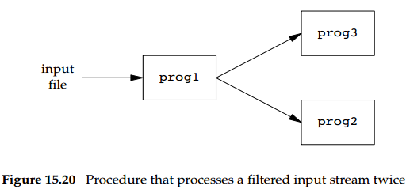

# 15.5 FIFOs

**FIFOs**也被成为**named pipes**。**Unnamed pipes**只能用在有血缘关系的进程之间，
而且是他们的祖先进程创建了**unnamed pipe**。而**FIFO***能在没有任何关系的进程之间交换数据。

chapter4中提到**FIFO**是**file**的一种类型。**stat**结构体的成员**st_mode**的其中
一种编码表明一个**file**可以是**FIFO**。我们可以使用**S\_ISFIFO**宏来检测。

创建一个**FIFO**和创建一个**file**类似。实际上，**FIFO**的**pathname**存在于文件系统(file system)中。

***
```
#include <sys/stat.h>
int mkfifo(const char *path,mode_t mode);
int mkfifoat(inf fd, const char *path,mode_t mode);
        Both return : 0 if OK, -1 on error
```
***
**mode**参数和**open**函数的mode参数相同(section 3.3).新FIFO的user和ownership则即我们在section4.6中讨论的规则
**mkfifoat**函数和mkfifo函数类似，不同之处是mkfifoat函数可以在代表fd的相对路径上创建一个**FIFO**，像其他的**\*at**
函数一样，这里有三个cases:
1. 如果**path**参数指定了绝对路径(absolute pathname),那么fd参数将被忽略，这样mkfifoat就和mkfifo一样了。
2. 如果**path**参数指定了相对路径(relative pathname)并且fd参数是一个目录的可用的file descriptor，那么路径是相对于这个目录的值。
3. 如果**path**参数指定了相对路径(relative pathname)并且fd参数值是**AT_FDCWD**,那么pathname始于当前工作目录，此时mkfifoat等同于mkfifo

一旦我们使用mkfifo/mkfifoat来创建FIFO,我们使用**open**函数来打开它。实际上，通用I/O函数（e.g.,close,read,write,unlink)同样适用于FIFOs

当我们open一个FIFO的时候，O_NONBLOCK(nonblocking 标记)会对发生什么起作用

* 通常情况下(没有O\_NONBLOCK),如果是read-only方式open的将一直blocks直到有其他进程打开FIFO并写入。同样的，以write-only方式open的会blocks直到有
其他进程opens FIFO来读。

* 如果指定了O\_NONBLOCK标识，那么以read-only方式open的将立即返回。但是以write-only方式open的将returns -1并把errno设置为ENXIO,如果没有进程打开FIFO读的话。

和pipe一样，如果我们往FIFO写（写的时候还没有进程读取FIFO）,这是会产生SIGPIPE信号。当最后一个writer关闭FIFO,文件结束符产生并传给FIFO的reader。

一个FIFO有多个writers,意味着我们得注意写操作的原子性----如果我们不希望其他进程s的写混淆的话。和pipes一样，常量PIPE_BUF指定了写往FIFO的最大数据量的大小。

FIFOs有两个用处：
1.用在shell 命令上。从第一个shell pipeline传递数据到另一个：不用创建临时文件。
2.FIFOs用于client-server架构的应用上用来做为clients和servers数据交互的交互点。

举栗说明：
## EXAMPLE--Using FIFOS to Duplicate Output Streams

通过一系列的shell commands操作，FIFOs可以用于duplicate一个输出流。这防止将数据写入中间磁盘文件（类似于使用管道避免中间磁盘文件）。 然并卵pipes只能用于进程之间的线性链接，而FIFO有一个名字，所以，它可用于非线性链接。
考虑一个需要过滤两次输入的步骤，如图15.20所示



使用一个FIFO和UNIX系统程序tee(1)，我们能在不适用临时文件的情况下实现这个步骤。（tee程序能够复制它的标准输入到它的标准输出和在它的command line上命名的文件）

***
```
    mkfifo fifo1      //create a FIFO
    prog3 < fifo1 &   //start prog3 in the background,reading from the FIFO
    prog1 < infile | tee fifo1 | prog2 //start prog1 and use tee to send its input to both the FIFO and prog2
```
***
># Tips
>##tee命令
>用于将数据重定向到文件，另一方面还可以提供一份重定向数据的副本作为后续命令的stdin。
>简单的说就是把数据重定向到给定文件和屏幕上。 

>

>存在缓存机制，每1024个字节将输出一次。若从管
>道接收输入数据，应该是缓冲区满，才将数据转存到指定的文件中。若文件内容不到1024个字节，则
>接收完从标准输入设备读入的数据后，将刷新一次缓冲区，并转存数据到指定文件
>

